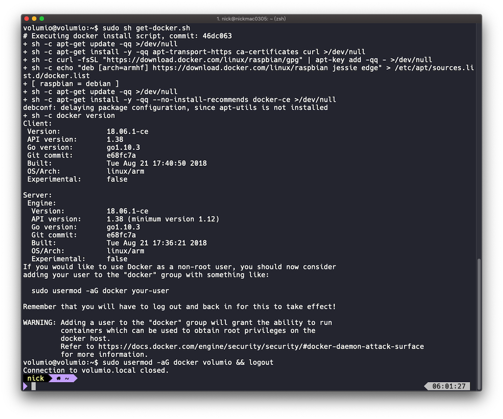
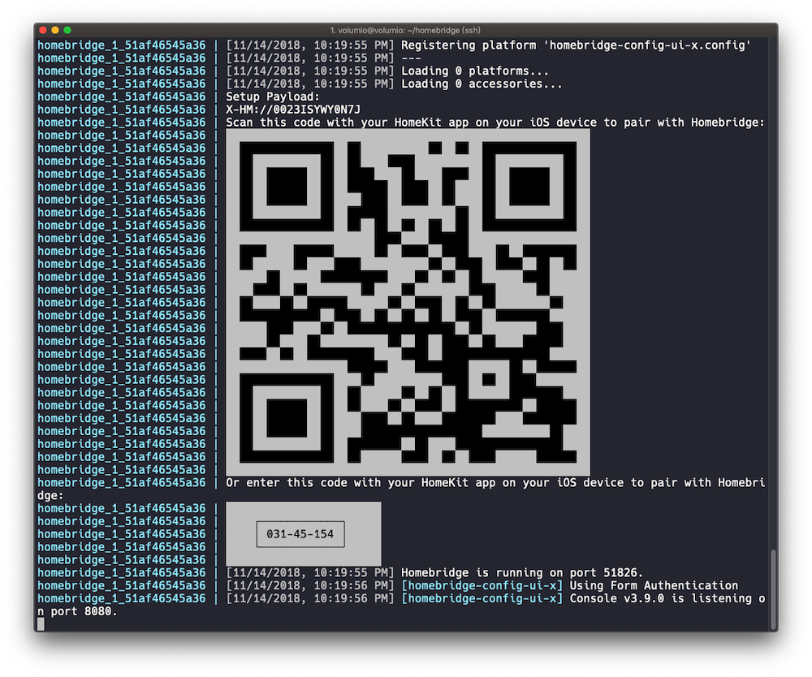

---
---
# 在樹莓派上搭建[Docker][docker-ce-link]並運行Homebridge

## 安裝方法簡易說明:

**事情準備**

>需要有一個已經安裝好系統並在運作的樹莓派
>可以透過SSH連線方式完成
>如需詳細樹莓派安裝說明, 可至[Wiki][docker-homebridge-wiki]參考安裝流程

**安裝流程**

1. 移除舊版本Docker[]
2. 安裝Docker[]
3. 安裝Docker Compose[]
4. 建立一個Docker Compose主要檔案[]
5. 啟動Homebridge[]
6. 管理Homebridge[]

## 資料來源:

- Docker官方安裝[docker-ce][docker-ce-link].
- Docker官方安裝[Docker Compose][docker-compose-link].
- 由[oznu/homebridge]發佈的[docker-homebridge-link]安裝Homebridge.
- 並且其[Wiki][docker-homebridge-wiki]中 Homebridge on Raspberry Pi 說明安裝流程.

## [1. 移除舊版本Docker]

開啟終端機並執行以下指令:

```
sudo apt-get remove docker docker-engine docker.io
```

## [2. 安裝Docker]


## 2-1. 使用Docker官方文檔中方式安裝:

1. 更新apt套件

```
sudo apt-get update
```

2. 經由 ```https``` 使用 ```apt``` 下載:

```
sudo apt-get install \
     apt-transport-https \
     ca-certificates \
     curl \
     gnupg2 \
     software-properties-common
```


3. 新增GPG密鑰簽署:

```
curl -fsSL https://download.docker.com/linux/raspbian/gpg | sudo apt-key add -
```

透過帶有字串 ```9DC8 5822 9FC7 DD38 854A E2D8 8D81 803C 0EBF CD88``` 來驗證密鑰

```
sudo apt-key fingerprint 0EBFCD88
pub   4096R/0EBFCD88 2017-02-22
      Key fingerprint = 9DC8 5822 9FC7 DD38 854A  E2D8 8D81 803C 0EBF CD88
uid                  Docker Release (CE deb) <docker@docker.com>
sub   4096R/F273FCD8 2017-02-22
```

4. Use the following command to set up the stable repository:

>注意: 以下 ```lsb_release -cs``` 子命令將返回Debian發行版的名稱, 如: ```jessie``` .

```
echo "deb [arch=armhf] https://download.docker.com/linux/debian \
     $(lsb_release -cs) stable" | \
    sudo tee /etc/apt/sources.list.d/docker.list
```

5. Update sources and install docker

```
sudo apt-get update
sudo apt-get install docker-ce
```

## 2-2. 安裝Docker方式二

>不知道什麼原因，我無法使用第2-1. 方式無法順利完成 **docker-ce** 的安裝
>後來在 `Docker`  [官方文檔][docker-ce-link] 中找到另一個方式，所以新增 `1-2. 方式二` 順利完成安裝

```
# 從Docker官方網址，獲取get-docker.sh自動安裝腳本檔案，下載後執行腳本即可完成
curl -fsSL get.docker.com -o get-docker.sh
sudo sh get-docker.sh
```



>在群組 ```docker``` 新增使用者 ```username``` . 
>因本次系統使用 ```Volumio``` 系統, 而使用者名稱為 `volumio`

```
sudo usermod -aG docker volumio && logout
```

## [3. 安裝Docker Compose]

有了 [Docker Compose][docker-compose-link] 之後, 安裝於Docker containers中變得相當容易, 首次安裝需透過Python與一些套件來完成安裝它:

```
sudo apt-get -y install python-setuptools && sudo easy_install pip  && sudo pip install docker-compose
```

## [4. 建立一個Docker Compose主要檔案]

在本例中使用者資料夾位於 ```volumio``` 資料夾, 依照以下指示建立新資料夾並且進到該資料夾中.

建立新資料夾, 並且於建立後進入資料夾:

```
mkdir /home/volumio/homebridge
cd /home/volumio/homebridge
```

然後使用 ```nano``` 編寫並建立名為 ```docker-compose.yml``` 的檔案.

```
nano docker-compose.yml
```

檔案內容應該如下列所示:

```js
version: '2'
services:
  homebridge:
    image: oznu/homebridge:raspberry-pi
    restart: always
    network_mode: host
    volumes:
      - ./config:/homebridge
    environment:
      - PGID=1000
      - PUID=1000
      - HOMEBRIDGE_CONFIG_UI=1
      - HOMEBRIDGE_CONFIG_UI_PORT=8080
```

使用 ```CTRL+X``` 儲存並且關閉檔案.

## [5. 啟動Homebridge]

在Docker container容器中啟動Homebridge, 執行以下指令:

```
docker-compose up -d
```

* 這個指令將會從 [oznu/homebridge][docker-homebridge-link] 下載最新版本的docker image.
* 使用 ```-d``` 是為了使docker-compose在背景啟動.

當Homebridge logs沒有顯示出任何問題, 並且成功運作中, 將會看到iOS的配對碼:

```
docker-compose logs -f
```

你的Homebridge ```config.json``` , 安裝外掛plugins時, 要能於 `家庭APP` 存取應用, 必須將外掛安裝於 ```config``` 資料夾中.



## [6. 管理Homebridge]

在本地電腦端開啟瀏覽器, 輸入下列網址並前往 ```http://<樹莓派ip>:8080```, 例: 我安裝於Volumio系統中, 我可以透過 ```http://volumio.local:8080``` 打開Homebridge管理頁面, 在此管理頁面中無論是安裝, 移除或升級任何外掛, 都務必要確保 ```config.json``` 檔案的正確性, 並且無論做任一項動作, 都必須將Homebridge重啟.

* 預設使用者名稱 `admin` 與密碼 `admin` 輸入後即可登入, 一定要重啟Homebridge才能使 ```config.json``` 所做修改的設定生效. 

可以透過執行下列指令來重啟或啟動這個容器:

```
docker-compose restart homebridge
```

- 與iOS的家庭APP連結

當以上都已經正常啟動也顯示了 ```打開家庭APP來執行配對``` , 那就打開它並且對準QR Code掃描吧.

- 預設配對碼: ```031-45-154```

如果APP顯示無法掃描, 那就手動輸入配對碼吧.

## 更新Homebridge

版本依然是由 [oznu/homebridge][docker-homebridge-link] 提供的最新版本作為更新.

執行指令在 [oznu/homebridge][docker-homebridge-link] 提供的image檔案中找到最新版本:

```
docker-compose pull homebridge
```

如果發現了有較新的版本, 將會自動下載image, 並將使用最新版本檔案作為container容器使用的image, 必須透過執行以下指令完成:

```
docker-compose up -d
```

## 以Shell形式訪問

如果有這個必要的話, 可以透過執行以下指令, 直接以 shell access 到 正在運行的container容器中:

```
docker-compose exec homebridge sh
```

[docker-ce-link]: https://docs.docker.com/install/linux/docker-ce/debian/#install-docker-ce-1
[docker-compose-link]: https://docs.docker.com/compose/overview/
[docker-homebridge-link]: https://hub.docker.com/r/oznu/homebridge/
[docker-homebridge-wiki]: https://github.com/oznu/docker-homebridge.wiki.git
